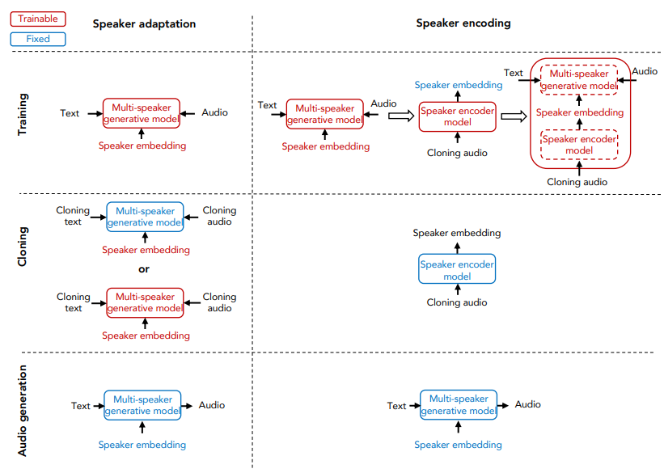

# Selected-Deepfakes-Audio-Materials 

A curated, but probably biased and incomplete, list of awesome Deepfakes resources specially selected for audios.
Even though this is a selected collection that cannot cover all relevant materials, we are trying to make this repo more self-contained.

This collection is enlightened by the work of a general deepfake material collection from (https://github.com/datamllab/awesome-deepfakes-materials).
As both deep learning and deepfakes are evolving fast these days, feel like it would be somehow helpful to create a separate repo here to collect materials on Deepfake audios.
If you want to contribute to this list, feel free to pull a request. 

## What is Deepfakes?

In December 2017, a user with name “DeepFakes” posted realistic looking videos of famous celebrities on Reddit. These fake videos are generated using deep learning, by swapping faces of original adult movies with celebrities’ faces. Since then, the topic of DeepFakes goes viral on internet.

Here, we denote DeepFakes as any fake contents generated by deep learning techniques. DeepFakes comes in different forms, perhaps the most typical ones are: 1) Videos and images, 2) Texts, and 3) Voices. Different deep learning techniques are used to generate DeepFakes. For instance, videos and images are usually created by Generative adversarial networks (GAN), while texts are mostly generated by deep language models based on Transformers.

It is worth pointing out the first type of videos and images are most well known deepfakes. This is relevant to the current high spread speed of videos and images on social media and multimedia websites like Youtube. 

## Table of Contents

* [Introduction](#introduction)
  * [Key Concepts](#key-concepts)
  * [General Architecture](#general-architecture)
  * [Online Articles of Deepfakes](#online-articles-of-deepfakes)
* [Attack Generation](#attack-generation)
  * [Fake Audio Generation](#fake-audio-generation)
  * [Relevant Code and Tools](#relevant-code-and-tools)
* [Defense](#defense)
  * [Deepfake Detection](#deepfake-detection)
  * [Defensive Audio Processing](#defensive-audio-processing)
* [Datasets and Challenges](#datasets-and-challenges)
* [Social Impacts](#social-impacts)
  * [Enterprise Solutions](#enterprise-solutions)
  * [Government Responses](#government-responses)
  * [Potential Threatened Scenarios](#potential-threatened-scenarios)
  

## Introduction

### Key Concepts
Voice Verification: the biometric technology that allows you to use your unique voiceprint to access your accounts when you access your services like bank accounts. Voice Verification is simple because it makes your voice your password (https://www.wellsfargo.com/privacy-security/voice-verification/). Verification outputs a binary result of whether the voice belongs to the speaker of not. If you need to know exactly who the speaker is, that would refer to the concept of 'voice identification'.

Voice Conversion: modify the speech of a source speaker and output speech sound like that of another target speaker without changing the original linguistic information. Oh you can simply regard it as a style transfer on audio.

Voice Clone: it is interchangeable with the above word of 'voice conversion' in many cases. But you can also more strictly say it is an area in voice conversion that simply aiming to copy a target's voice without merging it with a source voice.

### General Architecture
For the task of fake audio generation especially deepfake audio generation, there are three main type of models involved (definitions are extracted from this paper [Who Are You (I Really Wanna Know)? Detecting Audio {DeepFakes} Through Vocal Tract Reconstruction](https://www.usenix.org/system/files/sec22fall_blue.pdf)):

(1) Encoder: The encoder learns the unique representation of the speaker’s voice, known as the speaker embedding. The embedding is derived from a short utterance using the target speaker’s voice. The accuracy of the embedding can be increased by giving the
encoder more utterances, with diminishing returns. The output embedding from the encoder stage can be then passed as an input into the following synthesizer stage.

(2) Synthesizer: A synthesizer generates a Mel Spectrogram from a given text and the speaker embedding. A Mel Spectrogram is a spectrogram that has its frequencies scaled using the Mel scale, which is designed to model audio perception of the human ear. Some synthesizers can produce spectrograms solely from a sequence of characters or phonemes like [Tacotron](https://arxiv.org/pdf/1703.10135.pdf%EF%BC%89).

(3) Vocoder: The vocoder converts the Mel Spectrogram to retrieve the corresponding audio waveform. This newly generated audio waveform will ideally sound like a target individual uttering a specific sentence. A commonly used vocoder model is some variation of [WaveNet](https://arxiv.org/pdf/1609.03499.pdf), which uses a deep convolutional neural network that uses surrounding contextual information to generate its waveform.

There is a good figure that illustrates two technique paths for deepfake voice clone generation from paper [Neural Voice Cloning with a Few Samples](https://arxiv.org/abs/1802.06006). We attach it here to further explain this process.

From this same paper, we get ideas of these two paths:

(1) The idea of the speaker adaptation is to fine-tune a trained multi-speaker model for an unseen speaker using a few audio-text pairs. Fine-tuning can be applied to either the speaker embedding or the whole model.

(2) The idea of the speaker encoding method is to directly estimate the speaker embedding from audio samples of an unseen speaker. Such a model does not require any fine-tuning during voice cloning. Thus, the same model can be used for all unseen speakers.

Typically, speaker adaptation can achieve better performance than speaker encoding especially when more data samples can be used for the model tuning step. But the computation cost of speaker encoding is much lower because it does not need any further model tuning.

### Online Articles of Deepfakes

* [Deepfake: The Good, The Bad and the Ugly - Medium](https://medium.com/twentybn/deepfake-the-good-the-bad-and-the-ugly-8b261ecf0f52)
* [DeepFakes: AI-powered deception machines](http://www.computervisionblog.com/2018/05/deepfakes-ai-powered-deception-machines.html)
* [Exploring DeepFakes - KDnuggets](https://www.kdnuggets.com/2018/03/exploring-deepfakes.html)
* [Family fun with deepfakes. Or how I got my wife onto the Tonight Show - Towards Data Science](https://towardsdatascience.com/family-fun-with-deepfakes-or-how-i-got-my-wife-onto-the-tonight-show-a4454775c011)
* [Deepfake propaganda is not a real problem - The Verge](https://www.theverge.com/2019/3/5/18251736/deepfake-propaganda-misinformation-troll-video-hoax)

Deepfake Voices:
* [You can now speak using someone else’s voice with Deep Learning](https://towardsdatascience.com/you-can-now-speak-using-someone-elses-voice-with-deep-learning-8be24368fa2b)
* [A Voice Deepfake Was Used To Scam A CEO Out Of $243,000](https://www.forbes.com/sites/jessedamiani/2019/09/03/a-voice-deepfake-was-used-to-scam-a-ceo-out-of-243000/)
* [Voice cloning technology may have been used in Pearland scam](https://www.khou.com/article/news/local/pearland-father-daughter-voice-cloning-scam/285-1a7b0e9b-ccca-488c-afff-04dcec0d1e77)

## Attack
Even though we are focused on DeepFake audio attacks, it is worth pointing out audio based attacks can be more flexible.
Typical types of audio attacks (definition extracted from [ASVProof Challenge](https://www.asvspoof.org/asvspoof2021/asvspoof2021_evaluation_plan.pdf)):
* Logical Access (LA): bona fide and spoofed utterances generated using text-to-speech (TTS) and voice conversion (VC) algorithms are communicated across telephony and VoIP networks with various coding and transmission effects;
* Physical Access (PA): bona fide utterances are made in a real, physical space in which spoofing attacks are captured and then replayed within the same physical space using replay devices of varying quality;
* Speech Deepfake (DF): a fake audio detection task comprising bona fide and spoofed utterances generated using TTS and VC algorithms. Similar to the LA task (includes compressed data) but without speaker verification.

The LA and PA tasks are based on classical setting of automatic speaker verification (ASV).
In AVSProof contests, the metric for these two tasks will be the minimum tandem decision cost function (min t-DCF details can be in the doc link above) . 
The new DF task has a fake media / fake audio / deepfake flavour in which there is no ASV system. The metric for the DF condition will revert to the equal error rate (EER). EER is the point when the false acceptance rate and false rejection rate are equal.
 
pronounciation of numbers 

### DeepFake Audio Generation

Papers:
* Tacotron: Towards End-to-End Speech Synthesis. \[[Paper](https://arxiv.org/abs/1703.10135)\]
* Neural Voice Cloning with a Few Samples. \[[Paper](https://arxiv.org/abs/1802.06006)\]
* Deep Voice 3: Scaling Text-to-Speech with Convolutional Sequence Learning. \[[Paper](https://arxiv.org/abs/1710.07654)\]
* Deep Voice 3: Efficiently Trainable Text-to-Speech System Based on Deep Convolutional Networks with Guided Attention. \[[Paper](https://arxiv.org/abs/1710.08969)\]
* A unified system for voice cloning and voice conversion through diffusion probabilistic modeling. \[[Paper](https://diff-vc-vcl.github.io/)\] \[[Demo](https://diff-vc-vcl.github.io/)\]

### Relevant Code and Tools
* Coqui-TTS (https://github.com/coqui-ai/tts). 
* Real-Time-Voice-Cloning (https://github.com/CorentinJ/Real-Time-Voice-Cloning) Even though this tool seems to be the one on Github with the highest number of stars, the project itself has been archived because the development team is migrating to a startup of ResembleAI(https://www.resemble.ai/). However, this the simplest voice clone tool worth a trial(https://www.youtube.com/watch?v=1WN8Jhfd4uM).
Video intro from author: https://www.youtube.com/watch?v=-O_hYhToKoA.
* Tacotron 2 (https://github.com/NVIDIA/tacotron2). Voice Clone Tutorial: https://www.youtube.com/watch?v=b1fzyM0VhhI
* deep-voice-conversion (https://github.com/andabi/deep-voice-conversion)
* Tacotron (https://github.com/keithito/tacotron)
* MyCroftAI Mimic2  (https://github.com/MycroftAI/mimic2)
* Neural Voice Cloning with Few Samples. (https://github.com/Sharad24/Neural-Voice-Cloning-with-Few-Samples)
* Deepvoice3_pytorch. (https://github.com/r9y9/deepvoice3_pytorch)

## Defense

### Stay Alert In-Person
Even though the development of deepfake audio is fast, the realistic loss is usually not caused by the sole fake audio alone. 
In current research of fake audio detection, one natural metric is Mean Opinion Score([MOS](https://en.wikipedia.org/wiki/Mean_opinion_score)) by people themselves.
Generally speaking, currently generated audio clips seeking voice clone are still distinguishable from the following aspects:
* Inconsistent sentences
* Plain or sudden varying tone in speech
* Phrasing – consider the habit of the speaker
* Context of speech – Is it really the discussion topic that should be conducted?

The most important point is to hold a [Zero-Trust Ideology](https://en.wikipedia.org/wiki/Zero_trust_security_model) for sensitive cases: always be alert, always verify!

### Deepfake Detection
#### Review and General Papers:  
* Deep Learning for Deepfakes Creation and Detection (https://arxiv.org/abs/1909.11573).   
* DeepFakes and Beyond: A Survey of Face Manipulation and Fake Detection (https://arxiv.org/abs/2001.00179)  
* Media Forensics and DeepFakes: an overview (https://arxiv.org/abs/2001.06564).   
* Will Deepfakes Do Deep Damage? (https://cacm.acm.org/magazines/2020/1/241708-will-deepfakes-do-deep-damage/fulltext). 
* Tutorials/Papers from  NII Yamagishi Lab team. (https://nii-yamagishilab.github.io/, http://tonywangx.github.io/slide.html)

#### Detector Design:   
* FastAudio: A Learnable Audio Front-End for Spoof Speech Detection. 
\[[Paper](https://arxiv.org/pdf/2109.02774v1.pdf)\]
\[[Code](https://github.com/magnumresearchgroup/Fastaudio)\]
* Complementing Handcrafted Features with Raw Waveform Using a Light-weight Auxiliary Model. 
\[[Paper](https://arxiv.org/abs/2109.02773)\]
\[[Code](https://github.com/magnumresearchgroup/AuxiliaryRawNet)\]
* An Initial Investigation for Detecting Partially Spoofed Audio. 
\[[Paper](https://www.isca-speech.org/archive/interspeech_2021/zhang21ca_interspeech.html)\]

### Defensive Audio Processing
#### Attacking Deepfake Generator:  
* Defending Against Deepfakes Using Adversarial Attacks on Conditional Image Translation Networks.    
\[[Paper](https://arxiv.org/abs/2003.01279)\]
\[[Code](https://github.com/natanielruiz/disrupting-deepfakes)\]

#### Anomynization:  
* Language-Independent Speaker Anonymization Approach using Self-Supervised Pre-Trained Models. 
\[[Paper](https://arxiv.org/abs/2202.13097)\]
\[[Code](https://github.com/nii-yamagishilab/SSL-SAS)\]

## Datasets and Challenges

* ASVProof Challenge (https://www.asvspoof.org/)  ASVProof Challenge: a contest for fake audo-based attack detection that has been held for several times since 2015. It defines three types of audio attacks including deepfake audios. 
* ICASSP ADD 2022 (https://arxiv.org/abs/2202.08433) ICASSP ADD 2022: the first audio deep synthesis detection challenge(madarin language dataset)
* Voice Privacy Challenge (https://www.voiceprivacychallenge.org) VoicePrivacy: develop anonymisation and pseudonymisation solutions which suppress personally identifiable information while preserving linguistic content and speech quality/naturalness. It is worth pointing out, privacy is a very widespread concept. According to the [VoicePrivacy2020 Summary Report](https://arxiv.org/abs/2109.00648), this could include e.g., age, gender, ethnic origin, geographical background, health or emotional state, political orientations, and religious beliefs. Speaker recognition systems can also reveal the speaker’s identity. So we can say DeepFake audios can be regarded as kind of voice privacy leakage. 
* Kaggle Deepfake Detection Challenge (https://www.kaggle.com/c/deepfake-detection-challenge/overview?utm_medium=email&utm_source=intercom&utm_campaign=deepfake-competition-2019)  this contest was conducted in 2019, it is mainly focused on deepfake video detection, however, its dataset includes some modified audio parts
* CSIG Contest(http://fmfcc.net/#introduction)  Chinese audio deepfake contest. They provide a reference list of tools they use for dataset generation: http://fmfcc.net/contest-introduction
* Fake-or-Real(FOR) Dataset (https://bil.eecs.yorku.ca/datasets/#:~:text=The%20Fake%2Dor%2DReal%20(,classifiers%20to%20detect%20synthetic%20speech.)

## Social Impacts
### Enterprise Solutions
* Resemble AI(https://www.resemble.ai/andy-warhol/)
Resemble AI is a startup that is using three minutes audio for voice clone. They stem from the dev team of the Real-Time-Voice-Clone toolbox mentioned above. One interesting feature they introduce is the emotion masks that can be applied to the generated voice: https://www.youtube.com/watch?v=cXtgdsWw1xI
* Descript Overdub (https://www.descript.com/overdub)  
There is an online review for its voice clone function here: https://www.youtube.com/watch?v=H_SVsTOZHeM
* Respeecher (https://www.respeecher.com/) 
Speaking in the voice of Obama (Voice cloning): https://www.youtube.com/watch?v=t5yw5cR79VA
* Altered Studio (www.altered.ai)
Demo video: https://www.youtube.com/watch?v=-plK4bL2-2E

### Government Responses
* FBI Warning (https://www.ic3.gov/Media/Y2022/PSA220628)   Deepfakes and Stolen PII Utilized to Apply for Remote Work Positions
* DHS Report (https://www.dhs.gov/sites/default/files/publications/increasing_threats_of_deepfake_identities_0.pdf)  Department of Homeland Security provides a comprehensive report on the topic of deepfake threats. A relevant report: https://datasociety.net/library/deepfakes-and-cheap-fakes/
* DARPA MediFor Program (https://www.darpa.mil/program/media-forensics)  DARPA’s Media Forensics program (MediFor) builds algorithms to detect manipulated images or videos.(this seems to mainly relevant to visual media of images and videos not relevant to audios directly)

### Potential Threatened Scenarios

Bank voice verification
